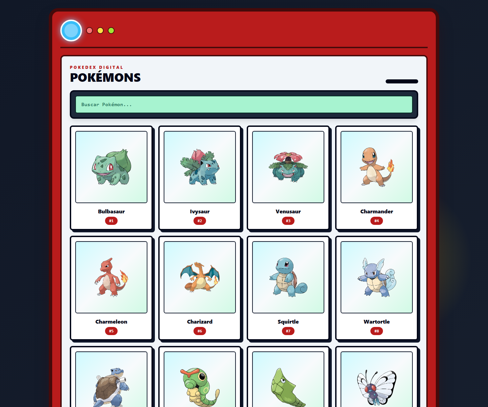

# PokeIA

Pokedex web feita com Next.js, TypeScript, Redux Toolkit e Tailwind CSS. O app lista Pokemons consumindo dados da PokeAPI e apresenta a interface com visual inspirado em uma pokedex.



## Tecnologias

- Next.js 13
- React 18
- TypeScript
- Redux Toolkit
- Tailwind CSS
- Docker
- Jest e Playwright

## Como rodar com Docker

```bash
docker compose up -d --build app
```

Acesse:

```text
http://localhost:3000/pokemons
```

Para desenvolvimento com volume local:

```bash
docker compose up dev
```

## Como rodar localmente

```bash
npm install
npm run dev
```

Acesse:

```text
http://localhost:3000
```

## Scripts

```bash
npm run build
npm run test
npm run test:e2e
```

## Estrutura principal

- `src/app/pokemons/page.tsx`: pagina principal da pokedex.
- `src/features/pokemon/components`: componentes da lista, busca, card e moldura visual.
- `src/features/pokemon/models`: estado, hooks e thunks de Pokemon.
- `src/services/api.ts`: configuracao da API.
